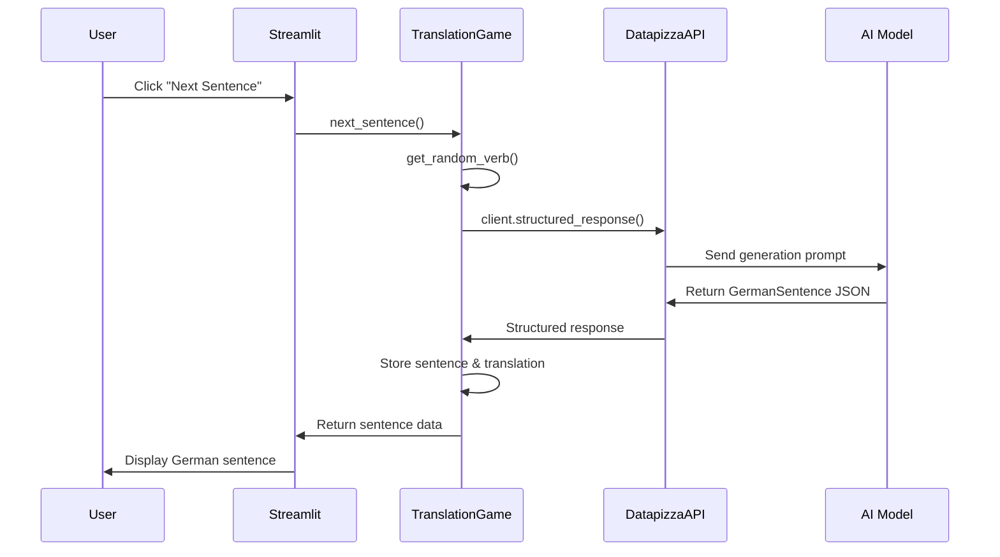
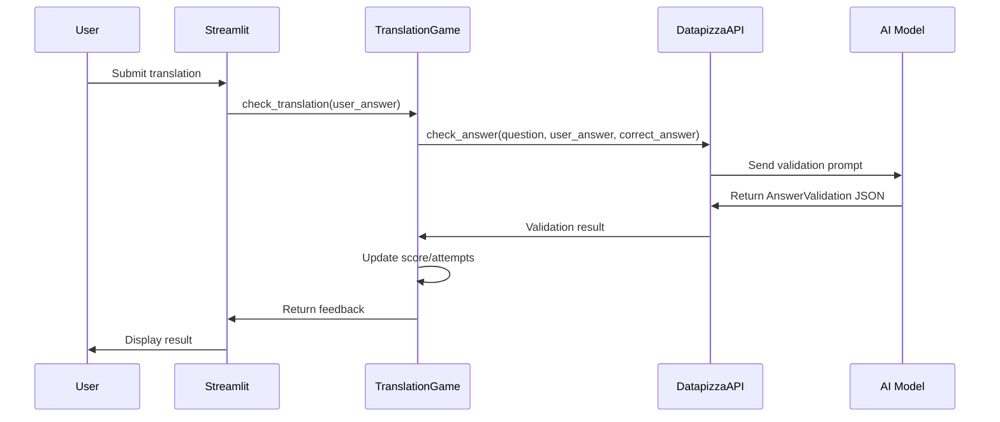
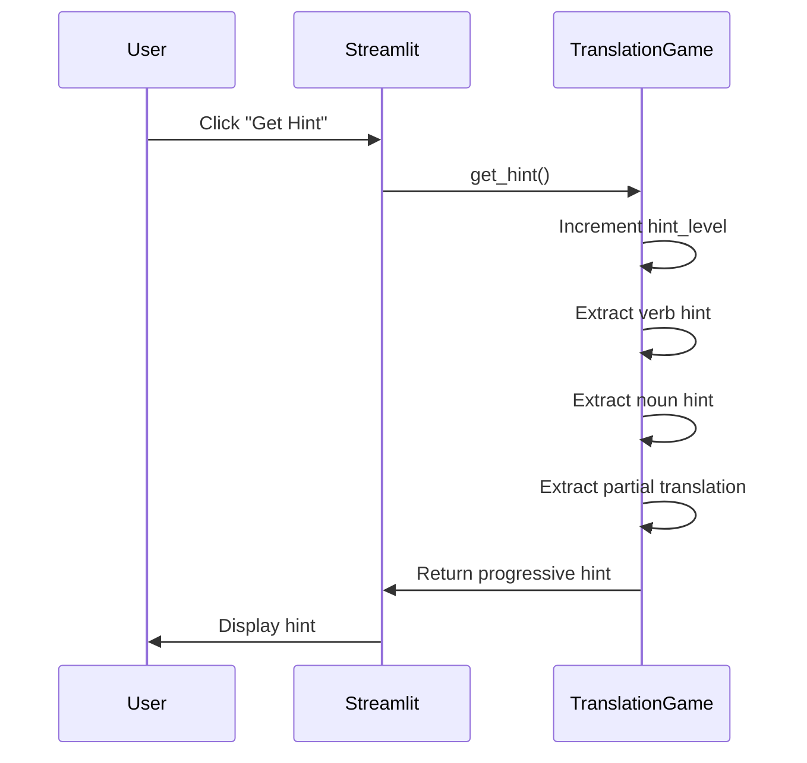

# 🏗️ Architecture Documentation

This document explains the internal structure, object creation patterns, API design, and chatbot communication flow of the German Translation Game application.

## 📋 Table of Contents

1. [Project Structure](#project-structure)
2. [Object Creation Patterns](#object-creation-patterns)
3. [API Architecture](#api-architecture)
4. [Chatbot Communication Flow](#chatbot-communication-flow)
5. [Data Flow Diagrams](#data-flow-diagrams)
6. [Key Design Patterns](#key-design-patterns)

## 🗂️ Project Structure

```
german-ai-chatbot/
├── app.py                          # 🎨 Streamlit Frontend Layer
├── requirements.txt                # 📦 Dependencies
├── .env                           # 🔐 Environment Variables
├── Dockerfile                     # 🐳 Container Definition
├── docker-compose.yml             # 🐳 Container Orchestration
├── data/                          # 📊 Language Data Layer
│   ├── verbi.csv                  # German verbs with frequency
│   ├── nomi.csv                   # German nouns
│   └── aggettivi.csv              # German adjectives
└── src/                           # 🧠 Core Application Logic
    ├── ai/                        # 🤖 AI Integration Layer
    │   ├── api.py                 # Abstract AI Interface
    │   └── datapizza_api.py       # Concrete Datapizza Implementation
    ├── functionalities/          # 🎮 Game Logic Layer
    │   ├── base.py                # Base Functionality Class
    │   ├── translation_game.py     # German→English Game
    │   └── inverse_translation_game.py # English→German Game
    ├── data/                      # 📈 Data Processing Layer
    │   └── verb_loader.py         # CSV Data Loader
    ├── chat/                      # 💬 Chat Management Layer
    │   └── chat.py                # Chat Orchestrator
    └── utils/                     # 🛠️ Utility Functions
        └── text_diff.py           # Text Comparison Utilities
```

## 🏭 Object Creation Patterns

### 1. **Dependency Injection Pattern**

The application uses dependency injection to create loosely coupled components:

```python
# app.py - Main initialization
def initialize_game(min_diff, max_diff, tense, provider, model, game_mode):
    # 1. Create API instance based on provider
    if "Google Gemini" in provider:
        api = DatapizzaAPI(provider="google", model=model)
    else:
        api = DatapizzaAPI(provider="ollama", base_url="http://localhost:11434/v1", model=model)
    
    # 2. Inject API into game functionality
    if game_mode == "English → German":
        game = InverseTranslationGameFunctionality(api=api)
    else:
        game = TranslationGameFunctionality(api=api)
    
    # 3. Initialize game with parameters
    game.start_game(difficulty=(min_diff, max_diff), tense=tense)
```

### 2. **Factory Pattern for AI Clients**

The `DatapizzaAPI` class acts as a factory for different AI providers:

```python
# datapizza_api.py
class DatapizzaAPI(AIChatbotAPI):
    def __init__(self, provider: Literal["ollama", "google"], ...):
        if provider == "google":
            self.client = GoogleClient(api_key=api_key, model=self.model, ...)
        else:  # ollama
            self.client = OpenAILikeClient(api_key="", model=self.model, ...)
```

### 3. **Strategy Pattern for Game Modes**

Different game functionalities implement the same interface:

```python
# base.py
class Functionality(ABC):
    @abstractmethod
    def execute(self, context: Dict[str, Any]) -> Dict[str, Any]:
        pass

# translation_game.py
class TranslationGameFunctionality(Functionality):
    def execute(self, context: Dict[str, Any]) -> Dict[str, Any]:
        # German → English logic

# inverse_translation_game.py  
class InverseTranslationGameFunctionality(Functionality):
    def execute(self, context: Dict[str, Any]) -> Dict[str, Any]:
        # English → German logic
```

## 🔌 API Architecture

### 1. **Abstract Interface Layer**

The `AIChatbotAPI` defines the contract for all AI implementations:

```python
# api.py
class AIChatbotAPI(ABC):
    @abstractmethod
    def receive_question(self, question: str) -> Dict[str, Any]:
        """Process incoming questions"""
        pass
    
    @abstractmethod
    def generate_answer(self, question: str, context: Dict[str, Any] = None) -> str:
        """Generate AI responses"""
        pass
    
    @abstractmethod
    def check_answer(self, question: str, user_answer: str, correct_answer: str = None) -> Dict[str, Any]:
        """Validate user answers"""
        pass
```

### 2. **Concrete Implementation with Datapizza**

The `DatapizzaAPI` implements the abstract interface using the Datapizza framework:

```python
# datapizza_api.py
class DatapizzaAPI(AIChatbotAPI):
    def __init__(self, provider, api_key=None, base_url=None, model=None):
        # Factory pattern for client creation
        if provider == "google":
            self.client = GoogleClient(api_key=api_key, model=model, ...)
        else:
            self.client = OpenAILikeClient(model=model, base_url=base_url, ...)
    
    def generate_answer(self, question: str, context: Dict[str, Any] = None) -> str:
        # Structured response using Pydantic models
        response = self.client.structured_response(
            input=question,
            output_cls=SimpleResponse
        )
        return response.structured_data[0].answer
```

### 3. **Structured Response Models**

All AI communications use Pydantic models for type safety:

```python
# datapizza_api.py
class GermanSentence(BaseModel):
    sentence: str = Field(description="The German sentence")
    translation: str = Field(description="English translation")
    explanation: str = Field(description="Grammar explanation")

class AnswerValidation(BaseModel):
    is_correct: bool = Field(description="Whether answer is correct")
    feedback: str = Field(description="User feedback message")
    correct_answer: str = Field(description="Correct answer if wrong")
    explanation: str = Field(description="Explanation of correctness")
```

## 🤖 Chatbot Communication Flow

### 1. **Sentence Generation Flow**



**Code Flow:**
```python
# translation_game.py - next_sentence()
def next_sentence(self) -> Dict[str, Any]:
    # 1. Get random verb from CSV
    verb = self.verb_loader.get_random_verb(min_freq=self.difficulty_range[0])
    
    # 2. Create generation prompt
    prompt = f"Generate a German sentence using '{verb['Verbo']}' in {self.tense}..."
    
    # 3. Call AI with structured response
    response = self.api.client.structured_response(
        input=prompt,
        output_cls=GermanSentence
    )
    
    # 4. Extract and store data
    sentence_data = response.structured_data[0]
    self.current_sentence = sentence_data.sentence
    self.current_translation = sentence_data.translation
```

### 2. **Answer Validation Flow**



**Code Flow:**
```python
# translation_game.py - check_translation()
def check_translation(self, user_translation: str) -> Dict[str, Any]:
    # 1. Call AI validation
    validation = self.api.check_answer(
        question=f"Translate to English: {self.current_sentence}",
        user_answer=user_translation,
        correct_answer=self.current_translation,
        context={"task": "translation", "source_language": "German"}
    )
    
    # 2. Update game state
    self.attempts += 1
    if validation.get('is_correct'):
        self.score += 1
    
    # 3. Generate feedback
    if validation.get('is_correct'):
        return {"is_correct": True, "message": f"✅ Correct! ({self.score}/{self.attempts})"}
    else:
        diff_text = simple_diff(user_translation, self.current_translation)
        return {"is_correct": False, "message": f"❌ Wrong.\n\n{diff_text}"}
```

### 3. **Hint System Flow**



**Code Flow:**
```python
# translation_game.py - get_hint()
def get_hint(self) -> Dict[str, Any]:
    self.hint_level += 1
    
    hints = []
    
    # Hint 1: Verb (extracted from English translation)
    if self.hint_level >= 1:
        verb_hint = self._extract_verb_hint()
        hints.append(f"🔹 Verb: {verb_hint}")
    
    # Hint 2: Nouns (extracted from English translation)
    if self.hint_level >= 2:
        nouns = self._extract_nouns_from_english()
        hints.append(f"🔹 Nouns: {', '.join(nouns)}")
    
    # Hint 3: Partial translation
    if self.hint_level >= 3:
        words = self.current_translation.split()
        half_words = words[:max(1, len(words) // 2)]
        hints.append(f"🔹 Start: {' '.join(half_words)}...")
```

## 📊 Data Flow Diagrams

### 1. **Application Initialization**

```
User Input (Settings) → Streamlit UI → initialize_game()
    ↓
DatapizzaAPI Factory → Create AI Client (Ollama/Gemini)
    ↓
TranslationGame Constructor → Inject API Dependency
    ↓
Game.start_game() → Set difficulty, tense, reset score
    ↓
Session State → Store game instance
```

### 2. **Sentence Generation Pipeline**

```
CSV Data → VerbLoader.get_random_verb() → Random verb selection
    ↓
Verb + Tense + Difficulty → Prompt construction
    ↓
Prompt → DatapizzaAPI.structured_response() → AI Model
    ↓
AI Response → GermanSentence Pydantic model → Structured data
    ↓
Structured data → TranslationGame.next_sentence() → Game state update
    ↓
Game state → Streamlit UI → User display
```

### 3. **Answer Validation Pipeline**

```
User Input → Streamlit form → TranslationGame.check_translation()
    ↓
User answer + Correct answer → Validation prompt construction
    ↓
Validation prompt → DatapizzaAPI.check_answer() → AI Model
    ↓
AI Response → AnswerValidation Pydantic model → Validation result
    ↓
Validation result → Score update → Feedback generation
    ↓
Feedback → Streamlit UI → User display
```

## 🎯 Key Design Patterns

### 1. **Dependency Injection**
- AI API injected into game functionalities
- VerbLoader injected into TranslationGame
- Clean separation of concerns

### 2. **Strategy Pattern**
- Different game modes (German→English vs English→German)
- Different AI providers (Ollama vs Gemini)
- Pluggable functionality system

### 3. **Factory Pattern**
- DatapizzaAPI creates appropriate AI clients
- VerbLoader creates verb instances from CSV
- Structured response model creation

### 4. **Template Method Pattern**
- Base Functionality class defines common interface
- Concrete implementations override specific methods
- Consistent execution flow across different games

### 5. **Observer Pattern**
- Streamlit session state acts as observable
- UI components react to state changes
- Automatic re-rendering on state updates

### 6. **Command Pattern**
- User actions trigger specific game commands
- Hint system uses progressive command execution
- Undo/redo capability through state management

## 🔧 Configuration Management

### Environment Variables
```python
# datapizza_api.py
env_path = Path(__file__).parent.parent.parent / '.env'
load_dotenv(dotenv_path=env_path)

# Google API key from environment
api_key = os.getenv("GEMINI_KEY")
```

### Docker Configuration
```yaml
# docker-compose.yml
services:
  app:
    build: .
    ports:
      - "8505:8501"
    env_file:
      - .env
    volumes:
      - ./data:/app/data:ro
```

## 🚀 Performance Optimizations

1. **Structured Responses**: Pydantic models ensure type safety and reduce parsing overhead
2. **Local Hint System**: Hints generated locally without AI calls for speed
3. **Session State Caching**: Game state persisted in Streamlit session
4. **Docker Layer Caching**: Requirements installed in separate layer for faster rebuilds
5. **Read-only Data Mounting**: CSV files mounted as read-only volumes

This architecture provides a clean, maintainable, and extensible foundation for the German translation learning application.
